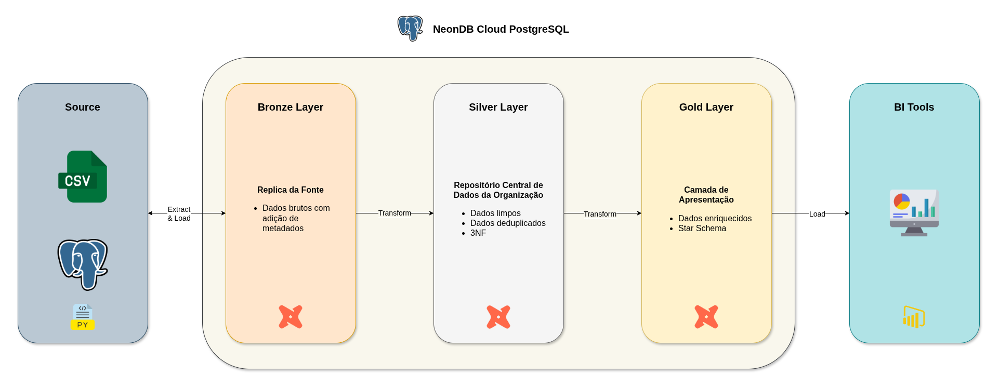
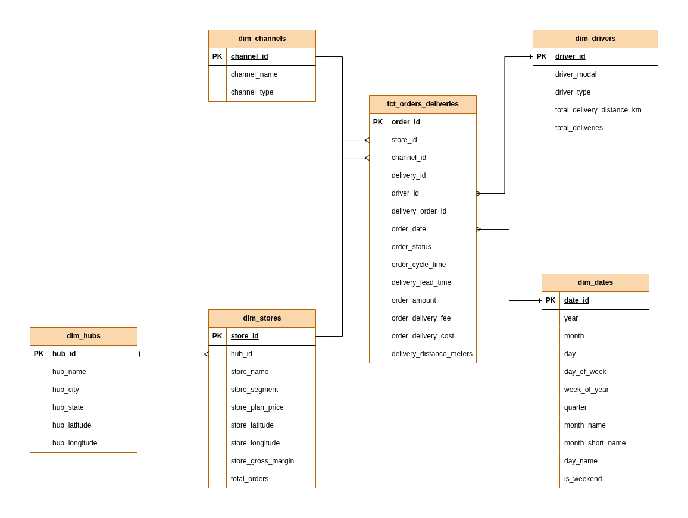

# 🛵 Construindo um Data Warehouse para o Delivery Center


### 📜Sumário
1. 📌 [Sobre o Projeto](#-sobre-o-projeto)
2. ⚙️ [Tecnologias Utilizadas](#️-tecnologias-utilizadas)
3. 🚀 [Como Executar](#-como-executar)
4. 📊 [Estrutura do Projeto](#-estrutura-do-projeto)
5. 🗒️ [Licença](#️-licença)
6. 📞 [Contato](#-contato)

## 📌 Sobre o Projeto
Com seus diversos hubs operacionais espalhados pelo Brasil, o Delivery Center é uma plataforma integra lojistas e marketplaces, criando um ecossistema saudável para vendas de good (produtos) e food (comidas) no varejo brasileiro.

Atualmente temos um cadastro (catálogo + cardápio) com mais de 900 mil itens, milhares de pedidos e entregas são operacionalizados diariamente com uma rede de milhares lojistas e entregadores parceiros espalhados por todas as regiões do país.

O projeto faz uso da arquitetura **medalhão** (bronze, silver, gold) para organizar esses dados em camadas conforme sua qualidade e nível de agregação:
- **Bronze**: Dados crus carregados diretamente de arquivos CSV.
- **Silver**: Dados limpos, padronizados e relacionados.
- **Gold**: Tabelas analíticas e métricas prontas para consumo em BI ou dashboards.



##### Diagrama Entidade Relacionamento



## ⚙️ Tecnologias Utilizadas
- 🐍 **Python** (Pandas, SQLAlchemy)
- 🐘 **PostgreSQL** (Banco de dados relacional)
- 🪛 **dbt (data build tool)** (Modelagem e transformação dos dados)

## 🚀 Como Executar

##### Clone o repositório
```bash
git clone https://github.com/datalopes1/deliverycenter_dwh.git
cd deliverycenter_dwh/
```
##### Instale as dependências
```bash
pip install -r requirements.txt
```
##### Configure o Banco de Dados
Crie um arquivo `.env` na raiz do projeto com suas credendciais, e ajuste seu `profiles.yml` do dbt. 
```plaintext
DB_USER=seu_usuario
DB_PASSWORD=sua_senha
DB_HOST=localhost
DB_NAME=seu_banco
```
##### Execute o script de ingestão
```bash
python src/data_ingestion.py
```
##### Rode os modelos do dbt
```bash
cd dwh/
dbt run
```
##### Execute testes (opcional)
```bash
dbt test
```
##### Gere a documentação (opcional)
```bash
dbt docs generate
dbt docs serve
```
## 📊 Estrutura do Projeto

```plaintext
deliverycenter_dwh/
├── data/                   
|   └── raw/                # Arquivos CSV brutos
├── dwh/                    # Projeto do dbt    
├── img/    
|   └── arq.png             # Diagrama da Arquitetura do DWH 
|   └── erdiagram.png       # Diagrama Entidade Relacionamento                    
├── src/
|   └── data_ingestion.py   # Script de ingestão dos dados
├── .gitignore              # Arquivos e pastas ignorados
├── LICENSE.md              # Licença do projeto
├── poetry.lock             # Arquivo lock do poetry
├── pyproject.toml          # Projeto do poetry
├── README.md               # Readme do repositório
└── requirements.txt        # Dependências
```

## 🗒️ Licença
Este projeto está licenciado sob a MIT License - veja o arquivo [LICENSE](LICENSE.md) para mais detalhes.

## 📞 Contato
- 📬 datalopes1@proton.me
- 🖱️ https://datalopes1.github.io/
- 📱 +55 88 99993-4237